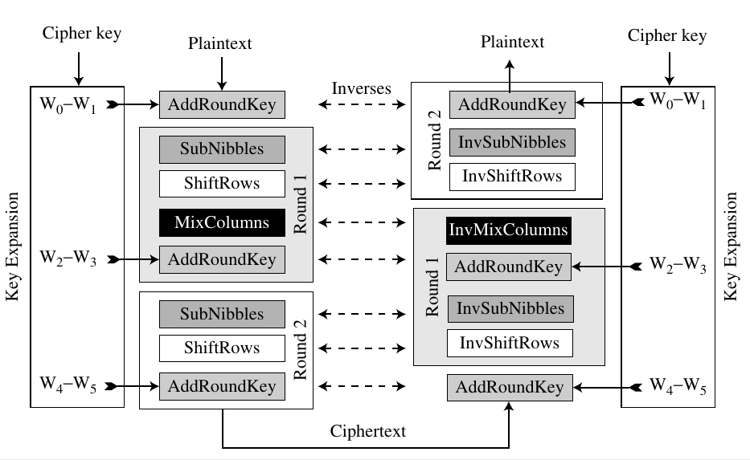
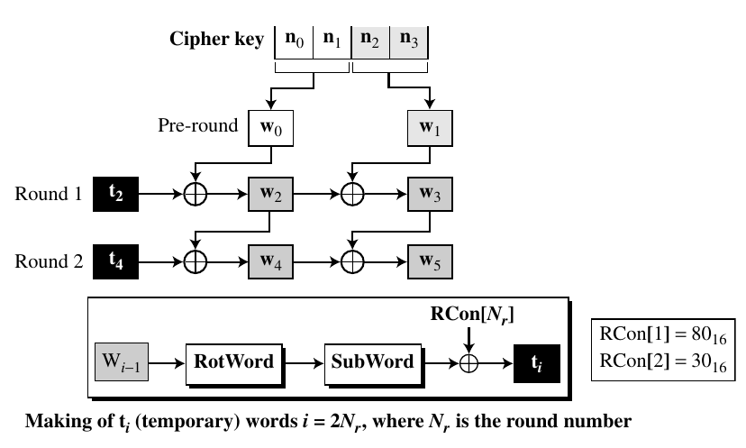

# Simplified AES

Simplified AES (S-AES) is an educational tool designed to help students learn the structure of AES using smaller blocks and keys.

- Non-feistal block cipher
- Plaintext: 16 bit
- Key: 16 bit
- Ciphertext: 16 bit

<p align="center">
  
  <br>
  <i>SAES Structure</i>
</p>

<p align="center">
  
  <br>
  <i>Key Expansion</i>
</p>

## Usage

Use the `SimplifiedAES` class in your program as follows.

For encryption:

```python
from saes import SimplifiedAES

plaintext = 0b1101011100101000
key = 0b0100101011110101
ciphertext = SimplifiedAES(key).encrypt(plaintext) # 0b0010010011101100
```

For decryption:

```python
from saes import SimplifiedAES

ciphertext = 0b0010010011101100
key = 0b0100101011110101
plaintext = SimplifiedAES(key).decrypt(ciphertext) # 0b1101011100101000
```

## References

Check out `theory.pdf` for more information and worked out examples.

## Authors

[Mayank Jain](https://github.com/mayank-02)

## License

MIT
